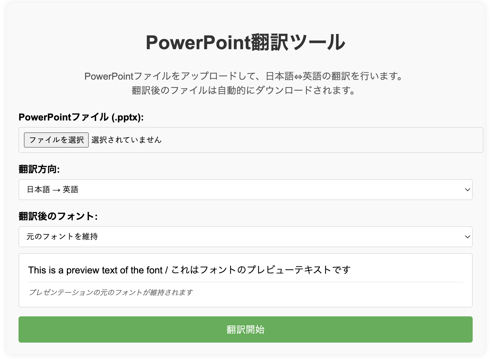

# PowerPoint翻訳ツール

PowerPointファイルの翻訳を自動化するウェブアプリケーションです。日本語と英語の間で翻訳を行い、翻訳後のフォントも選択できます。



## 機能

- PowerPointファイル(.pptx)の翻訳
- 日本語 → 英語、英語 → 日本語の双方向翻訳
- 翻訳後のテキストフォント選択
- スライドのデザインやレイアウトを維持したままテキストのみを翻訳
- 表内のテキストも翻訳

## 使い方

1. PowerPointファイル(.pptx)をアップロード
2. 翻訳方向（日本語→英語、または英語→日本語）を選択
3. 翻訳後のフォントを選択（オプション）
4. 「翻訳開始」ボタンをクリック
5. 処理が完了すると、翻訳済みファイルが自動的にダウンロードされます

## デプロイ

このアプリケーションは以下のサービスを使用してデプロイできます：

### Render.com (推奨)

1. GitHubリポジトリにコードをプッシュ
2. Render.comでアカウント作成
3. 「New Web Service」からリポジトリを連携
4. 以下の設定を行う：
   - Environment: `Python 3`
   - Build Command: `pip install -r requirements.txt`
   - Start Command: `gunicorn app:app`
   - 環境変数:
     - `DEEPL_API_KEY`: （オプション）DeepL APIキー
     - `PORT`: `10000`（Render推奨値）

### その他のデプロイオプション

- Heroku
- Google Cloud Run
- PythonAnywhere

## ローカル環境で実行

```bash
# リポジトリをクローン
git clone https://github.com/yourusername/ppt-translator.git
cd ppt-translator

# 仮想環境を作成（オプション）
python -m venv venv
source venv/bin/activate  # Windows: venv\Scripts\activate

# 依存パッケージをインストール
pip install -r requirements.txt

# 環境変数を設定（オプション）
# export DEEPL_API_KEY=your_deepl_api_key

# アプリケーションを実行
python app.py
```

ブラウザで http://localhost:5001 にアクセスしてアプリケーションを使用できます。

## 技術スタック

- **バックエンド**: Flask (Python)
- **翻訳API**: Google Translate API / DeepL API
- **PowerPoint操作**: python-pptx
- **フロントエンド**: HTML/CSS/JavaScript, jQuery

## 注意点

- 翻訳はGoogle TranslateまたはDeepL APIを使用しています
- DeepL APIを使用する場合は、環境変数に`DEEPL_API_KEY`を設定してください
- 大きなファイル（多数のスライドを含むファイル）は処理に時間がかかる場合があります
- 複雑なレイアウトやアニメーションは一部維持されない場合があります

## カスタマイズ

### 翻訳言語の追加

`translate_text_deepl`関数を修正することで、他の言語対応も可能です。

### フォントオプションの追加

HTML内の`<select id="font_name">`要素に新しい`<option>`を追加することで、利用可能なフォントを増やせます。


---

## ライブラリ

このアプリケーションは以下のライブラリに依存しています：

```
flask
python-pptx
deep-translator
gunicorn
```

これらは `requirements.txt` に記載されています。

## トラブルシューティング

**Q: アップロード時にエラーが発生する**  
A: PowerPointファイル(.pptx)のみが対応しています。古い形式(.ppt)は対応していません。

**Q: デプロイがうまくいかない**  
A: `requirements.txt`に必要なパッケージがすべて含まれていることを確認してください。また、環境変数の設定も確認してください。

**Q: 翻訳結果が正確でない**  
A: 自動翻訳の性質上、すべての翻訳が完璧になるわけではありません。専門用語や特殊な表現は、翻訳後に手動で修正することをお勧めします。

---
